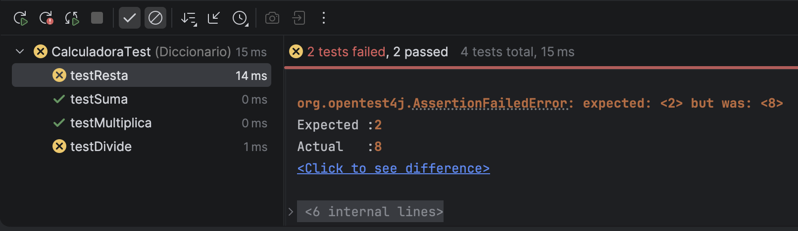
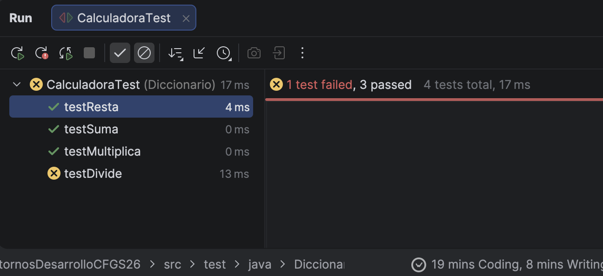

# Calculadora

    ## Ejercicio 1



```
package Diccionario;

import Calculadora.Calculadora;
import org.junit.Test;

import static org.junit.jupiter.api.Assertions.assertEquals;

public class CalculadoraTest {
    @Test
    public void testSuma() {

        Calculadora calculadora = new Calculadora(3, 5);

        int valorEsperado = 8;
        int valorObtenido = calculadora.suma();

        assertEquals(valorEsperado, valorObtenido);

    }

    @Test
    public void testResta() {

        Calculadora calculadora = new Calculadora(5, 3);

        int valorEsperado = 2;
        int valorObtenido = calculadora.resta();

        assertEquals(valorEsperado, valorObtenido);

    }

    @Test
    public void testDivide() {

        Calculadora calculadora = new Calculadora(10, 5);

        int valorEsperado = 2;
        int valorObtenido = calculadora.divide();

        assertEquals(valorEsperado, valorObtenido);

    }

    @Test
    public void testMultiplica() {

        Calculadora calculadora = new Calculadora(3, 5);

        int valorEsperado = 15;
        int valorObtenido = calculadora.multiplica();

        assertEquals(valorEsperado, valorObtenido);

    }
}
```

## Solucionado

```
@Test
public void testResta() {

        Calculadora calculadora = new Calculadora(5, 3);

        int valorEsperado = 8;
        int valorObtenido = calculadora.resta();

        assertEquals(valorEsperado, valorObtenido);

    }
```
