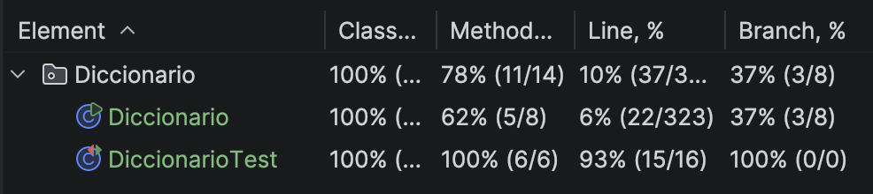

## Tarea JUnit - Diccionario

### Métodos probados

- **nuevoPar**: Se comprueba que, al introducir un par español-inglés, la información se guarda correctamente en el sistema.
- **traduce**: Se comprueba que el método devuelve la traducción exacta cuando la palabra existe y gestiona correctamente cuando no está almacenada.
- **palabraAleatoria**: Se comprueba que la palabra obtenida al azar pertenezca realmente al conjunto de palabras guardadas.
- **primeraLetraTraduccion**: Se comprueba que el sistema devuelve la inicial correcta de la traducción en inglés.

### Cobertura



### Tests
```
package Diccionario;

import org.junit.jupiter.api.Test;
import static org.junit.jupiter.api.Assertions.*;

import java.util.Scanner;

public class DiccionarioTest {

    // Inserción correcta de pares
    @Test
    void testInsercionCorrecta() {
        // Usamos un Scanner que lee directamente de un String
        Scanner teclado = new Scanner("mesa-table");

        Diccionario.nuevoPar(teclado);

        assertEquals("table", Diccionario.diccionario.get("mesa"));
    }

    // Traducción de palabras existentes
    @Test
    public void testTraduccionExistente() {
        Diccionario.diccionario.put("perro", "dog");
        assertEquals("dog", Diccionario.traduce("perro"));
    }

    // Traducción de palabras NO existentes
    @Test
    public void testTraduccionInexistente() {
        assertNull(Diccionario.traduce("avion"));
    }

    // Obtención de una palabra aleatoria
    @Test
    public void testPalabraAleatoria() {
        Diccionario.diccionario.put("rojo", "red");
        Diccionario.diccionario.put("azul", "blue");

        String resultado = Diccionario.palabraAleatoria();
        assertTrue(Diccionario.diccionario.containsKey(resultado));
    }

    // Primera letra de la traducción
    @Test
    void testPrimeraLetraTraduccion() {
        Diccionario.diccionario.put("manzana", "apple");

        String input = "manzana";
        System.setIn(new java.io.ByteArrayInputStream(input.getBytes()));

        Diccionario.teclado = new java.util.Scanner(System.in);

        assertDoesNotThrow(Diccionario::primeraLetraTraduccion);
    }

    // Comportamiento con diccionario vacío
    @Test
    public void testDiccionarioVacio() {
        assertTrue(Diccionario.diccionario.isEmpty());
    }
}
```